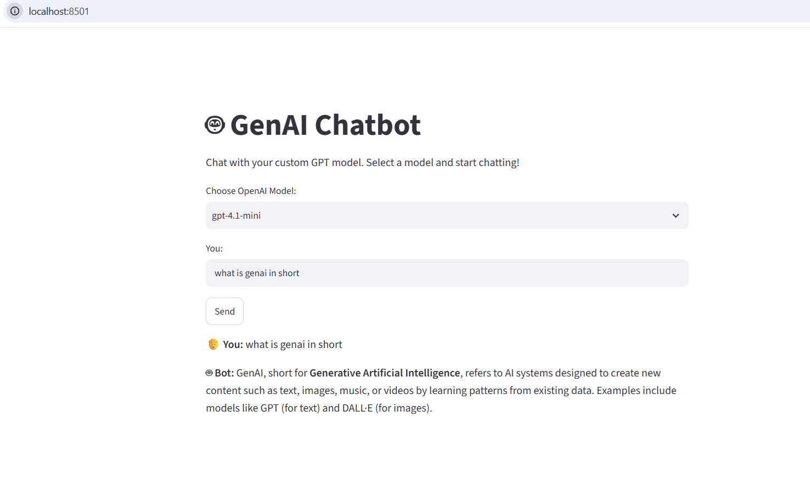

# 🧠 GenAI Chatbot (OpenAI + Streamlit)

A simple Generative AI chatbot built with **Python, Streamlit, and OpenAI API**.  
This project allows you to chat with different GPT models using a clean web interface.

---

## 🚀 Features
- Chat with OpenAI GPT models (e.g., `gpt-4.1-mini`)
- Simple Streamlit UI with dropdown model selection
- Secure API key handling using `.env` file
- Easy to run locally

---

## 📸 Demo Screenshot


---

## ⚙️ Installation & Setup

### 1. Clone the repository
```bash
git clone https://github.com/<your-username>/genai-openai-chatbot-streamlit.git
cd genai-openai-chatbot-streamlit

### 2. Create virtual environment (optional but recommended)
```bash
python -m venv venv
venv\Scripts\activate      # Windows

### 3. Install dependencies
```bash
pip install -r requirements.txt

### 4. Add your OpenAI API key
Create a .env file in the project root
OPENAI_API_KEY=your_api_key_here

### 5. Run the app
```bash
streamlit run frontend.py


📂 Project Structure
Code
├── backend.py        # Handles OpenAI API calls
├── frontend.py       # Streamlit UI
├── requirements.txt  # Dependencies
├── .env              # API key (ignored in git)
├── .gitignore        # Ignore sensitive files
├── screenshot.png    # Demo screenshot
└── README.md         # Project documentation
